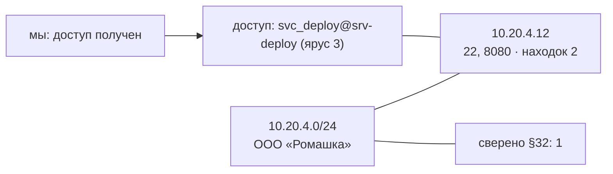

# Карта объекта — пример сборки (06.10.2026)

Собрано кодом: `python3 app.py map 1`. Эта же карта уходит модели в подсказку
(краткий вид), в документ передачи (схема) и в панель. Секретов в карте нет.

## Текстом (для подсказки и человека)

```
КАРТА ОБЪЕКТА (собрана кодом; секретов в карте нет)
  объект: 10.20.4.0/24 (ООО «Ромашка»)
  основание: договор 12/2026 от 01.09.2026
  область работ: 10.20.4.0/24
  стадия: доступ получен (сессия 1)
  поверхность (скан №1, 2026-10-04T12:15:04+00:00):
    порты: 22, 8080
    сервисы: http, ssh
    продукты: nginx
    10.20.4.12: порты 22, 8080; находок 2; важность: high, medium
  где стоим: svc_deploy@srv-deploy (ярус 3), способ: штатный ssh, проверено: id
  ЗАПРЕТ: панель и SMB не ронять
  СВЕРЕННЫЕ СВЕДЕНИЯ (§32, опираться на них, не противоречить):
    скан №1 от 04.10.2026 (0 дн.) — данные свежие
```

## Схемой (mermaid — в отчёт и панель)


